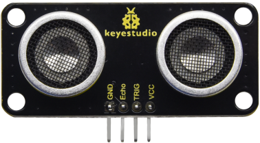
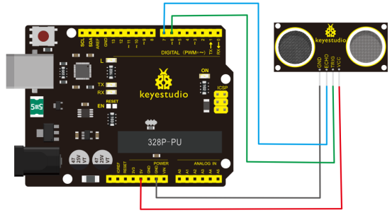
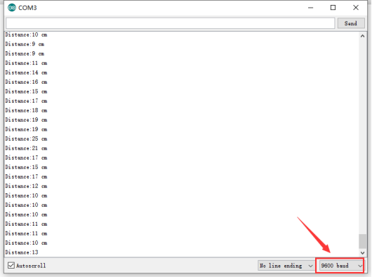

# KS0504 Keyestudio SR01 Ultrasonic Sensor V3



## 1. Introduction

The Keyestudio SR01 Ultrasonic sensor is a very affordable and detects the distance between the ultrasonic sensor and obstacle. It adopts CS100A chip, compatible with 3.3V and 5V. Its maximum detection distance is 3m and blind area is less than 4cm.

As same as the principle of the bat, ultrasonic module sends a high frequency signals that the human body cannot hear. They will travel back if encountering the obstacle. On receiving the returned information, it will calculate the distance between the sensor and the obstacle by determining the time difference of the transmitted signal and the received signal.

**Specification：**

- Working Voltage: DC 3.3V-5V
- Working Current: 50mA－100mA
- Working Frequency: 40KHz
- Max Power: 0.5W
- Max Range: 3m
- Min Range: less than 4cm
- Measuring Angle: less than 15 degree
- Trigger Input Signal: 10µS TTL pulse
- Interface：4 pin port with 2.54mm space
- Position Holes： the diameter is 3mm
- Working Temperature： -10℃ - +60℃
- Size：49mm * 22mm * 19mm
- Environmental attributes: ROHS

## 2. Hook up



## 3. Test Code

Download code : [Code](./Code.7z)

```c
#define echoPin 7 // Echo Pin
#define trigPin 6 // Trigger Pin
int maximumRange = 200; // Maximum range needed
int minimumRange = 0; // Minimum range needed
long duration, distance; // Duration used to calculate distance

void setup() 
{
 Serial.begin (9600);
 pinMode(trigPin, OUTPUT);
 pinMode(echoPin, INPUT);
}

void loop() 
{
 /* The following trigPin/echoPin cycle is used to determine the
 distance of the nearest object by bouncing soundwaves off of it. */ 
 digitalWrite(trigPin, LOW); 
 delayMicroseconds(2); 
 digitalWrite(trigPin, HIGH);
 delayMicroseconds(10); 
 digitalWrite(trigPin, LOW);
 duration = pulseIn(echoPin, HIGH);
 //Calculate the distance (in cm) based on the speed of sound.
 distance = duration/58.2;
 
 if (distance >= maximumRange || distance <= minimumRange)
 {
 	 Serial.println("-1");
 }
 else 
 {
     Serial.print("Distance:");
     Serial.print(distance);
     Serial.println(" cm");
 }
 //Delay 50ms before next reading.
 delay(50);
}
```

Code-setting Principle:

1. Use IO trigger ranging, at least 10us HIGH level signal; that is, first pull the Trip Low, then give a HIGH level signal of 10us.
2. The module automatically sends eight square waves of 40khz to automatically detect whether there is a signal return back;
3. There is a signal return, through the IO output a High level, and the duration period of High level is the time of Ultrasonic wave from emission to return.
   Test distance = (High level time * speed of sound (340M/S))/2
   Then you can get the formula: detection distance = (High level time/58)(cm)

## 4. Test Result

Burn code, hook up, pug in power with USB cable, open serial monitor and set baud rate to 9600. You can view the distance value between ultrasonic sensor and obstacle, unit is cm, as shown below:

